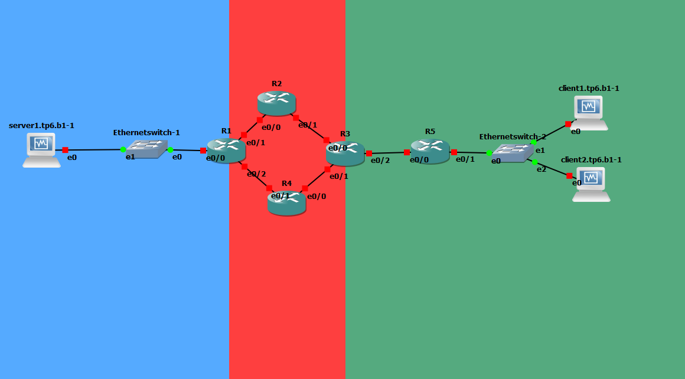

# TP 6 - Une topologie qui ressemble un peu à quelque chose, enfin ?

Pour ce TP, on va encore avoir besoin de **GNS3** et de **Virtualbox**.

* Nos machines seront sous **CentOS 7 Minimal**
* Le routeur Cisco sera un Cisco 3640
* Et les switchs sont les switchs de base dans GNS3


## Lab 1 : Simple OSPF
Petit lab simple pour comprendre le concept.

`OSPF : Open Shortest Path First`

## Lab 2 : Un peu de complexité (et d'utilité ?...)

### 1. Présentation du lab et contexte

Petite reprise de ton schéma pour être d'accord sur la topologie.


Il est indiqué qu'il y a 2 serveurs, mais pour le TP on va faire avec qu'un seul.

On peut observer les "Areas" sur le schéma,on va s'en servir pour utiliser OSPF.

* On va avoir :
    * Une aire "backbone" -> `Area 0`
        * Tout trafic qui change d'area passe forcément ici
    * Une aire pour l'infra -> `Area 1`
        * Petit serveur web ou netcat afin de simuler un service disponible
    * Une aire pour les clients -> `Area 2`
        * 2 clients seront ajoutés
        * Adressage IP automatique via DHCP

Ca donne ca !



### Réseaux IP et aires OSPF

Voici le tableau des réseaux IP, les mêmes que sur le schéma mais plus pratique !

Réseaux | `area 0` | `area 1` | `area 2` | Commentaire
--- | --- | --- | --- | ---
`10.6.100.0/30` | X | - | - | Liaison entre `r1` et `r2`
`10.6.100.4/30` | X | - | - | Liaison entre `r1` et `r4`
`10.6.100.8/30` | X | - | - | Liaison entre `r2` et `r3` 
`10.6.100.12/30` | X | - | - | Liaison entre `r3` et `r4`
`10.6.101.0/30` | - | X | - | Liaison entre `r3` et `r5`
`10.6.201.0/24` | - | X | - | Réseau des clients
`10.6.202.0/24` | - | - | X | Réseau des serveurs

### Adressage IP de chacune des machines

Machines | `10.6.100.0/30` | `10.6.100.4/30` | `10.6.100.8/30` | `10.6.100.12/30` | `10.6.101.0/30` | `10.6.201.0/24` | `10.6.202.0/24`
--- | --- | --- | --- | --- | --- | --- | --- 
`r1.tp6.b1` | `10.6.100.1` | `10.6.100.5` | - | - | - | - | `10.6.202.254`
`r2.tp6.b1` | `10.6.100.2` | - |  `10.6.100.9` | - | - | - | -
`r3.tp6.b1` | - | - | `10.6.100.10` | `10.6.100.13` | `10.6.101.1` | - | -
`r4.tp6.b1` | - |  `10.6.100.6` | - | `10.6.100.14` | - | - | -
`r5.tp6.b1` | - | - | - | - |  `10.6.101.2` |  `10.6.201.254` | -
`client1.tp6.b1` | - | - | - | - | - |  `10.6.201.10` | -
`client2.tp6.b1` | - | - | - | - | - |  `10.6.201.11` | -
`server1.tp6.b1` | - | - | - | - | - | - | `10.6.202.10`


#### Checklist IP Routeurs

Pour le routeur 1 on a :

```
R1(config)#interface ethernet 0/0
R1(config-if)#ip address 10.6.202.254 255.255.255.0  # E 0/0 vers Area 2 -> Ethernet Switch
R1(config-if)#interface ethernet 0/1
R1(config-if)#ip address 10.6.100.1 255.255.255.252 # E 0/1 vers Area 0 -> R2
R1(config-if)#interface ethernet 0/2
R1(config-if)#ip address 10.6.100.5 255.255.255.252 # E 0/2 vers Area 0 -> R4

```

Pour le routeur 2 :

```
R2(config)#interface ethernet 0/0
R2(config-if)#ip address 10.6.100.2 255.255.255.252
R2(config-if)#no shut
*Mar  1 00:05:51.779: %LINK-3-UPDOWN: Interface Ethernet0/0, changed state to up
*Mar  1 00:05:52.779: %LINEPROTO-5-UPDOWN: Line protocol on Interface Ethernet0/0, changed state to up
R2(config-if)#exit
R2(config)#interface ethernet 0/1
R2(config-if)#ip address 10.6.100.9 255.255.255.252
R2(config-if)#no shut
R2(config-if)#
*Mar  1 00:06:58.635: %LINK-3-UPDOWN: Interface Ethernet0/1, changed state to up
*Mar  1 00:06:59.635: %LINEPROTO-5-UPDOWN: Line protocol on Interface Ethernet0/1, changed state to up
R2(config-if)#exit
```

Pour le routeur 3 :

```
R3(config)#interface ethernet 0/0
R3(config-if)#ip address 10.6.100.10 255.255.255.252
R3(config-if)#no shut
R3(config-if)#
*Mar  1 00:06:53.943: %LINK-3-UPDOWN: Interface Ethernet0/0, changed state to up
*Mar  1 00:06:54.943: %LINEPROTO-5-UPDOWN: Line protocol on Interface Ethernet0/0, changed state to up
R3(config-if)#exit
R3(config)#interface ethernet 0/1
R3(config-if)#ip address 10.6.100.13 255.255.255.252
R3(config-if)#no shut
R3(config-if)#
*Mar  1 00:09:21.247: %LINK-3-UPDOWN: Interface Ethernet0/1, changed state to up
*Mar  1 00:09:22.247: %LINEPROTO-5-UPDOWN: Line protocol on Interface Ethernet0/1, changed state to up
r3.tp6.b1(config)#interface ethernet 0/2
r3.tp6.b1(config-if)#ip address 10.6.101.1 255.255.255.252
r3.tp6.b1(config-if)#no shut

```

Pour le routeur 4 :

```
R4(config)#interface ethernet 0/0
R4(config-if)#ip address 10.6.100.14 255.255.255.252
R4(config-if)#no shut
R4(config-if)#
*Mar  1 00:08:48.047: %LINK-3-UPDOWN: Interface Ethernet0/0, changed state to up
*Mar  1 00:08:49.047: %LINEPROTO-5-UPDOWN: Line protocol on Interface Ethernet0/0, changed state to up
R4(config-if)#exit
R4(config)#interface ethernet 0/1
R4(config-if)#ip address 10.6.100.6 255.255.255.252
R4(config-if)#no shut
*Mar  1 00:09:52.439: %LINK-3-UPDOWN: Interface Ethernet0/1, changed state to up
*Mar  1 00:09:53.439: %LINEPROTO-5-UPDOWN: Line protocol on Interface Ethernet0/1, changed state to up
*Mar  1 00:09:59.675: %SYS-5-CONFIG_I: Configured from console by console
```

Et enfin, pour le routeur 5 :

```
R5(config)#interface ethernet 0/0
R5(config-if)#ip address 10.6.101.2 255.255.255.252
R5(config-if)#no shut
R5(config)#interface ethernet 0/1
R5(config-if)#ip address 10.6.201.254 255.255.255.0
R5(config-if)#no shut
```
Une fois que tout ceci est fait, `wr` est une commande plutôt sympa :)

`On sauvegarde les builds sur tous les routeurs`

On change ensuite nos hostnames.


#### Checklist VMs

Pour les biens du TP, une connexion host only a été configurée.

* IPs et Hostnames
    * Client 1 `client1.tp6.b1` : 192.168.20.3
    * Server 1 `server1.tp6.b1`: 192.168.20.4
    * Client 2 `client2.tp6.b1`: 192.168.20.5

Ensuite pour chaque machines il va falloir remplir le fichier hosts.

`sudo nano /etc/hosts`

`Server1` :
```
127.0.0.1   localhost localhost.localdomain localhost4 localhost4.localdomain4
::1         localhost localhost.localdomain localhost6 localhost6.localdomain6
10.6.201.10 client1 client1.tp6.b1
10.5.201.11 client2 client2.tp6.b1
```

`Client1` :
```
127.0.0.1   localhost localhost.localdomain localhost4 localhost4.localdomain4
::1         localhost localhost.localdomain localhost6 localhost6.localdomain6
10.6.201.11 client2 client2.tp6.b1
10.6.202.10 server1 server1.tp6.b1
```

`Client2` :

```
127.0.0.1   localhost localhost.localdomain localhost4 localhost4.localdomain4
::1         localhost localhost.localdomain localhost6 localhost6.localdomain6
10.6.201.10 client1 client1.tp6.b1
10.6.202.10 server1 server1.tp6.b1
```

#### Activation d'OSPF
Le but, c'est que chaque routeur partage le réseau auquel il est connecté.

Routeur 1 :

```
r1.tp6.b1(config)#router ospf 1
r1.tp6.b1(config-router)#router-id 1.1.1.1
r1.tp6.b1(config-router)#network 10.6.100.0 0.0.0.3 area 0
r1.tp6.b1(config-router)#network 10.6.100.4 0.0.0.3 area 0
r1.tp6.b1(config-router)#network 10.6.202.0 0.0.0.255 area 2
```

Routeur 2 :

```
r2.tp6.b1(config)#router ospf 1
r2.tp6.b1(config-router)#router-id 2.2.2.2
r2.tp6.b1(config-router)#network 10.6.100.0 0.0.0.3 area 0
r2.tp6.b1(config-router)#network 10.6.100.8 0.0.0.3 area 0
```

Routeur 3 :

```
r3.tp6.b1(config)#router ospf 1
r3.tp6.b1(config-router)#router-id 3.3.3.3
r3.tp6.b1(config-router)#network 10.6.100.8 0.0.0.3 area 0
r3.tp6.b1(config-router)#network 10.6.100.8 0.0.0.3 area 0
*Mar  1 00:10:09.875: %OSPF-5-ADJCHG: Process 1, Nbr 1.1.1.2 on Ethernet0/0 from LOADING to FULL, Loading Done
r3.tp6.b1(config-router)#network 10.6.100.12 0.0.0.3 area 0
r3.tp6.b1(config-router)#network 10.6.101.0 0.0.0.3 area 1
```


Routeur 4 :

```
r4.tp6.b1(config)#router ospf 1
r4.tp6.b1(config-router)#router-id 4.4.4.4
r4.tp6.b1(config-router)#network 10.6.100.4 0.0.0.3 area 0
r4.tp6.b1(config-router)#network 10.6.100.12 0.0.0.3 area 0
```


Okaaay après avoir fait ca, on ping routeur 1 et routeur 5:

```
r1.tp6.b1#ping 10.6.101.2 # IP du routeur 5

Type escape sequence to abort.
Sending 5, 100-byte ICMP Echos to 10.6.101.2, timeout is 2 seconds:
!!!!!
Success rate is 100 percent (5/5), round-trip min/avg/max = 32/42/48 ms
r1.tp6.b1#ping 10.6.201.254
```


**REFAIRE TOUT L'OPSF du routeur 5 (Il a été foiré j'crois)**